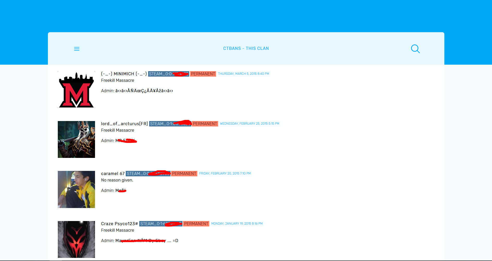

<p align="center">
    
    
    
</p>
# CTBans Web
A web script for ctbans that supports databomb's ctbans plugin. 
Soon support for Baras teambans and CT Bans by oaaron99 will be added.

# Config
A quick guide on how to set it up.
Go ahead and open the configuration file `back/config.php`.

#### Database
Update the section `db` with your database information. The (sm) plugin database must match.

#### Miscellaneous
In the `site` section you can change the location where this will exist (`url`).  
##### `Dropdown` 
Here you can add custom links. The format is as follows:  
```php
'Link title' => 'http://url',
```

#### Api key
This script makes use of the Steam Web Api, to fetch players data, so make sure you set up one.
Can be found at: https://steamcommunity.com/dev

#### Debug
If you're having issues or errors, set the `debug` section to `true`.

#### `allowedSteamids`
Here you can specify which users can access the admin to:  
* Modify (WIP)
* Add (WIP)
* and Delete bans.

Here you can add a list of steam community ids.

## Suggestions / Errors
Feel free to open a new issue!

## Screenshots
